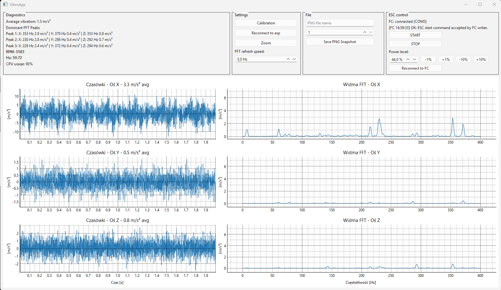

# VibroApp



Real-time vibration monitor for ESP32 sensor data with live time-domain and FFT plots for X, Y, and Z axes. AI generated code.

## Features
- Reads vibration data from a connected ESP32 over serial
- Shows live waveform and FFT charts for all three axes
- Displays average vibration and dominant FFT peaks
- Supports calibration and PNG snapshot export
- Provides basic ESC power control for FC-connected motors

## Requirements
- Python 3.10+
- PyQt6
- pyqtgraph
- numpy
- psutil
- pyserial

Install dependencies:

```bash
pip install PyQt6 pyqtgraph numpy psutil pyserial
```

## Run

```bash
python vibro.py
```

If the ESP32 port is not detected automatically, the app will ask you to select the serial port manually.

### File mode

Open a binary burst file (DVB1) instead of asking for a mode:

```bash
python vibro.py --file path/to/data.bin
```

### Debug mode

Validate a burst file and exit without opening the GUI:

```bash
python vibro.py --debug --file path/to/data.bin
```

## Project Structure

The code is split into small modules by concern. `vibro.py` is the only entry point — run it with `python vibro.py`.

| Module | Responsibility |
| --- | --- |
| `config.py` | Constants and the `SEQ_LINE` regex |
| `utils.py` | Gravity removal, DVB1 burst parsing, port discovery |
| `dialogs.py` | Startup mode dialog and port-selection dialog |
| `serial_io.py` | `SerialWorker` thread: reads ESC32 burst lines |
| `esc_telemetry.py` | `FCTelemetryReader` thread: Betaflight motor-RPM telemetry |
| `fft_worker.py` | `FFTWorker` thread: amplitude spectra for submitted chunks |
| `app.py` | `RealtimeVibeApp` orchestrator (UI + plotting + threads) |
| `vibro.py` | Entry point: argument parsing and app startup |

## Notes
- The app expects ESP32 data in the format used by this project.
- FFT processing is handled in a worker thread to reduce UI lag.
- ESC control is intended for testing and should be used carefully.
